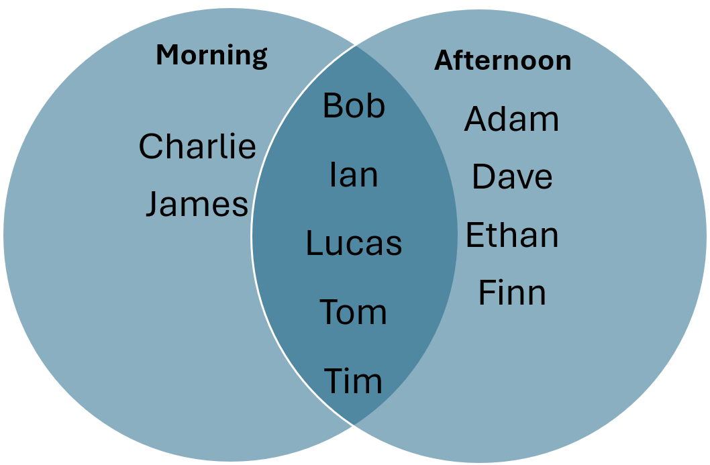

# Rationale
I was inspired to start this project when I entered PLC and observed the way timetables were generated. Timetables were generated on a daily basis which indicated the timings and specific duties to be completed, along with some other miscellaneous roles (such as the person in charge of drawing breakfast and dinner). 

The typical approach involved taking the previous week's timetable as reference, and then modifying it to suit the needs of the current week - based on the manpower for the day, ensuring fairness, and variety in the duties (generally every consecutive duty alternates). These were done by manually swapping around duties till an acceptable timetable was obtained.

The timetables, made using excel sheets, were modified by selecting and manually dragging the cells. Some limitations of this process included difficulties in splitting merged cells (splitting up longer duties into shorter ones), adding more troopers (involving moving all cells down) and truly randomising duties (as swapping duties manually may not truly randomise over all troopers).

Although this process was not that time consuming, I felt that there could be an easier way to automate generating timetables while still giving flexibility to the user in deciding specific duties or shifts. Providing flexibility and ease of use to the user at every step of the process was very important given the personalised nature of the timetable. This gave rise to the app, which is **aimed to be semi-automated and allow the user to indicate specific duties and then autogenerating the rest**.


# Stage 1: Prototyping: Creating core timetable generating functionality `timetable_scheduling.py`
For context, are around 11 troopers that do duty and around 5 duties - PAC (x-ray), sentry, VAC (in, out), Pass Office (desk) - that need to be carried out constantly from 6am to 6pm, with additional duties like SCA carried out in the morning. In total this amounts to 66 hours of duty to be completed. Due to the large number of permutations for the schedules possible, generating all possible schedules and finding the most optimal one would take a long time, and in some cases, the most optimal schedule may not even exist - there may be many schedules that are viable. 

Hence rather than finding an optimal schedule, finding a feasible schedule which satisfies certain constraints seemed more suitable. This lead me to find out about constraint programming, a branch of programming that is great in achieving this very goal. After some research, I found out about Google OR tools, a powerful constraint programming library, and decided to use this for my project.

I then broke down the entire schedule generating process into several sequential steps as below:

## Step 1: Assign sentry
In the timetable, every duty is 1h in duration and every duty generally alternates among each other. For instance, a trooper doing x-ray for one shift is usually not allocated x-ray again for the next shift. This is except first and last duties which are 2h long, and for sentry which has variable duration depending on the number of combat troopers. 

For instance, if there are 12h of sentry to be distributed, they can be distributed as such:

| Number of troopers | Distribution of hours |
| -------- | -------- |
| 4 | 3 3 3 3 |
| 5 | 3 2 2 2 3 |
| 6 | 2 2 2 2 2 2 |

Since the minimum duration for sentry is 2h, if there are more than 6 combat troopers, 6 troopers are randomly selected and the others dont do sentry, doing more of other roles instead.

This is implemented in the `assign_sentry_duty` function


## Step 2: Assign shifts and hours
The programme then allows the user to input any specific duties that they want to indicate. For instance, lets say trooper A has a medical appointment from 2pm to 6pm - this time period can be blocked off. Or if trooper B has not done first desk in a long time - this can be set. Any other specific duties can be set as well.

The programme then analyses this updated timetable (containing custom specific duties) and comes up with all the possible shifts that each trooper can do. The 3 types of shifts are morning, afternoon, and random. For morning and afternoon shifts, the end and start times can be set respectively. Random shifts are shifts that dont follow any pattern and duties can be distributed throughout the day.

### `find_all_available_shifts`
In the inner function `check_if_all_in_given_shift`, the function looks through the individual timetable of the trooper and checks if the trooper has duties outside of the given shift. If he does, then it returns False.

For example, if a trooper Adam is doing x-ray from 12noon to 2pm, and desk from 4pm-6pm, and the morning shift ends by 2pm, the trooper cannot do the morning shift due to his 4-6pm desk. 

Similarly, the above is checked for afternoon shift. Suppose if afternoon shift starts at 10am, both custom duties of desk and x-ray lie within the shift duration (10am-6pm), hence the trooper can do afternoon shift.

All troopers can do random shift since there is no pattern to it (except stay-outs since they cant do early morning shift)

Hence as a whole, using the inner function, the function `find_all_available_shifts` returns ['afternoon', 'random'] for Adam. It similarly computes the possible shifts for all troopers and returns it in a dictionary, like below:
```
{
    'Adam': ['afternoon', 'random'], 
    'Bob': ['morning', 'afternoon', 'random'], 
    'Charlie': ['random', 'morning'], 
... 
}
```

### `select_shifts`
Based on the possible shifts, the programme now has to select a shift for each trooper. The below venn diagram illustrates the dictionary above, for morning and afternoon shifts:



Lets say the number of required morning and afternoon troopers is 4 and 4 respectively. Since morning shift is lacking 2 troopers, 2 troopers are randomly chosen and topped up from the intersection, Ian and Tom. Now from the remaining afternoon troopers, 4 are randomly chosen. The remaining troopers are random troopers. This could lead to a result like this:

```
Morning: Charlie, James, Ian, Tom
Afternoon: Bob, Adam, Finn, Lucas
Random: Dave, Ethan, Tim
```

The general rule would be:
- If morning/afternoon are lacking troopers, top up from the intersection
- Otherwise, randomly select the number of troopers required from the entire morning/afternoon

### `compute_hours`
This computes the number of hours for duty and its distribution. For instance, if there are 66 hours of duty to be compled with 12 troopers, the hour distribution would be 6 troopers doing 5 hours and 6 trooper doing 6 hours. 

The minimum and maximum hours are calculated by taking the average hours and rounding down and up respectively.

It does this using 2 simultaneous equations (t stands for trooper and h stands for hours)-

$h_{min}t_{min} + h_{max}t_{max} = h_{total}$  
$t_{min} + t_{max} = t_{total}$

In this example:  
$5t_{min} + 6t_{max} = 66$  
$t_{min} + t_{max} = 12$

Solving these 2 equations gives $t_{min} = 6, t_{max} = 6$

### `generate_duty_hours`
Based on the earlier hour distribution generated, distribute the hours to troopers. Since frequently the afternoon shift ends earlier than 6pm (around 4.30pm-5pm), allocate the longer hours first (6h in this case) to those doing afternoon shift, followed by random, followed by morning.

## Step 3: Assign duty timeslots using Google OR Tools
This uses OR-tools to generate a feasible timetable where the duty timeslots are determined. For each trooper and timeslot, a boolean variable is generated in the model - if the value is 0 then the trooper is not having duty, and if the value is 1 then the trooper is having duty.

`duties[(p, t)] = model.new_bool_var(f"duty_p{p}_t{t}")`
where p is the trooper and t is the timeslot for every trooper and every timeslot

### Constraints

| Constraint | Explanation |
| --- | --- |
| Predetermined duty should be filled in | if timetable is marked with a None (no duty), set the variable to 0 and if a duty has already been assigned, then set variable to 1 |
| A trooper should not do duty out of their assigned shift | If a trooper is doing morning shift (eg 6am - 2pm), they should not get duty out of their shift (eg at 3pm). This applies if they are assigned specific shifts (eg morning/afternoon) |
| A trooper should get a lunch break (1h break) from 11am-3pm if they are doing straight duty with no breaks | Solver shouldnt allocate continuous duty such that it prevents lunch break
| There should be n duties filled per timeslot where n is the number of roles | For example if there are 5 duties, only 5 duties should be assigned for that hour (sounds straightforward but if not implemented it wont work)|
| Number of timeslots assigned = number of hours assigned in `generate_duty_hours`| Without this constraint the solver can distribute the timeslots unevenly (anyhow) |
| All first and last duties should be the first 2 hours | This is except SCA which is also 2h but can also be from 7am-9am |


## Step 4: Assign specific duties using Google OR Tools
This builds on the timetable generated earlier and determines the specific duties. For each duty timeslot, an integer variable is generated in the model - the range of the variable is the number of roles. For example, if there are 5 roles then the domain will be from 0 to 4.

`assigned_duties[(p,t)] = model.new_int_var_from_domain(domain_1, f"duties_{p}_{t}")`
where p is the trooper and t is the timeslot for every trooper and every timeslot.

### Constraints
| Constraint | Explanation |
| --- | --- |
| Set all preselected roles | Fix the roles that have already been selected
| Within 1 timeslot, all duties must be distinct | Since each duty is only performed by 1 person. This means that the integer value of the p in each timeslot is unique |
| Set the first duty and last duty to be same across the first and last 2 hours respectively | Eg if first duty is from 6am-8am and the first duty chosen is x-ray, let both 6am-7am and 7am-8am be x-ray |
| If someone does both first and last duty, they dont get the same duty | Eg someone doesnt do both first x-ray and last x-ray |
| Prevent consecutive duties from being the same **except for first/last and user defined duties** | Adds more variety to timetable |
| Prevent allocating 3h standing in a row | Eg, dont allow combinations like in out in, out in out |

## Step 5: Allocate miscellaneous roles and export
### `allocate_miscellaneous_roles`
Allocate miscellaneous roles with the following rules:
| Miscellaneous role | Rule |
| --- | --- |
| Flag troopers | Only select from those who are not excused from marching |
| Breakfast | The first out draws breakfast, and if the first out is not a permanent trooper, the first in draws instead |
| Dinner | The last out draws dinner, and if the last out is a stayout or is not a permanent trooper, the last in draws instead |


After confirming the miscellaneous roles, export the timetable using `create_excel`
